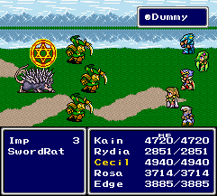

## RoboRaider
A JRPG engine I accidentally(?) made while trying to learn game development from scratch. :)

### Technical Features
* Customizable JRPG game that can be modified to be an entirely new game of its own. Similar to DOOM for FPS.
* Geared towards 16-bit graphic style, but with modern support due to `libgdx` as the main library. Can use colorful sprites, backgrounds, animations as well as CD-quality music and sound.
* Components and API to create new transitions, effects, managers and entities.

### Specific Features
* Top-down orthogonal tile map view.
* *Dragon Quest* inspired first person battle system.
* *Final Fantasy* inspired menu system.
* Extendable enemy and Asset registry. Create new enemies using JSON files!

### Table of Contents

* Introduction
* Known Issues and Quirks
* System Requirements
* Atrributions and Copyrights
* Building the Project
* Source Code Overview
* Engine Basics
    * Configuration.json
    * Game Loop
    * Menu Graphics and Fonts
    * Monster Entities, Graphics, and Battle Animations
    * Dialog
    * Entities Definition
    * Callbacks
    * Menu System
    * Battle System
* Programming and API
    * Charater Sprites
    * Dialog Boxes

### Introduction

I am the same as most boys of the 1990s. Growing up playing Windows 3.x and DOS games on the computer, and NES/SNES games in front of the TV was the norm. It wouldn't be an exaggeration to say that video games have been influential in my life. They really have made me who  I am today.

The most memorable video game genre I have intense memories of are JRPGs of the 16-bit era. And, if you count some of the Gameboy games, that'd be some of the 8-bit era too!

Since being exposed to these 16-bit JRPGs during my childhood, I have always wanted to make one of my own. In fact, I studied computer programming as a teenager and went on to major in Computer Science for this very reason: to acquire some technical ability to make a JRPG of my own one day.

There are a few JRPGs which have been inspirational to me. For the 16-bit Super Nintendo system, here are some of my favorites:

* Final Fantasy IV (US)
* Final Fantasy V (EN translation from the JP version)
* Chrono Trigger
* Super Mario RPG
* Star Ocean
* Dragon Ball Z: Chou Saiya Densetsu

     

And for 8-bit, I have been inspired mostly by the Pokemon Red/Blue series for the Gameboy.


All in all, I've always been fascinated by the technical development, graphics, music and stories of these games. I had always found pleasure immersing myself in movies, and books. It was natural that role playing games would be my personal gaming preference.

Sometime in early 2018, I finally decided that I should try to achieve the personal goal of one day creating a JRPG style game from scratch. Not from readily made game makers like RPG Maker, or Game Maker... but one with my own custom engine. One that would customized and tailored to fit my game's needs.

This project is basically that attempt in creating the JRPG. Although I have yet to have a game, this engine is a product of some of the nights I had spent experimenting. This project is basically the engine in which I hope my future JRPG game will be based off of.

The code you see here is in perpetual "WIP" -- work in progress. It is an incomplete attempt at a JRPG game, which somehow turned into a basic JRPG game engine written in `Java 8` using the `libgdx` library.

So, enjoy! Clone, fork, whatever! Make your own game, learn from my mistakes and most importantly, have fun!

### Known Issues and Quirks

As with all hobby projects, you'll find weird quirks and hacks around the code. Don't be surprised. I'm going to defend myself here and say that I had **0 knowledge** in developing games when I first spun up the project. Although I have tried my best to refactor and do a few re-writes in some of the components, you'll find that they still wouldn't be up to snuff in a professional setting.

Make what you will of that...

Here is the good news: I do plan to clean up the code, architecture and add some more documentation as I close in on having the features that I personally want for this engine. The *master* branch of this repository will reflect that.

Anyway, here are some of the known issues, or things... or whatever-you-want-to-call-it at the moment:

1. There is a memory leak somewhere. I know. I just need to spend a weekend firing up VisualVM (https://visualvm.github.io/) to profile the performance of the engine.
2. Code sucks, I know. This thing has been pretty much a sandbox in testing ideas, but work is being made to clean it all up.
3. Undocumented API. Yeah, pretty much the whole project needs to be documented properly. This is why I am writing this README file, afterall.
4. Weird inconsistencies. To be honest, I have never had design discussions in my head and didn't really practice any personal code reviews in the beginning. It was just a pump-and-dump of ideas early on. As a consequence of that, you'll see the technical debt show in some of the areas of the code -- especially the things that deal with `sprite` and `map` management.

### System Requirements

The machine that this project has been developed and tested on is a **2014 13" MacBook Pro**.

For those who need a base specification, here it is:

* Core i7 4578U @ 3.00 GHz (Dual Core)
* 16 GB DDR3 RAM
* 256 GB SSD
* Retina Display (2560x1600)
* Intel Iris GPU (40 CU)
* Mac OS X 10.14.1 (Mojave), IntelliJ, Java JDK 8

As you can see, it isn't the most powerful machine out there. The machine is going on 5 years old as it is nearing 2019. It shows you can get by with running this engine with modest specifications.

Basically, if you can run a Java IDE with `JDK 8` installed, with some sort of 3D accelerator @ a `640x480` resolution, then you will be fine. I expect a lot of modern machines to pass with flying colors.

### Attributions and Copyrights

A bunch of the included assets are either have been created by myself, procured to be for use, and/or downloaded from [OpenGameArt](https://opengameart.org).

```
ui/cursor.png - https://opengameart.org/content/hand-cursor
```

Orchid on title screen is by PumpkinGlitters at: http://pumpkinglitters.deviantart.com/ 

### Building The Project

The recommended IDE to use for building and developing this project is JetBrain's IntelliJ IDEA. You can grab the community edition here: https://www.jetbrains.com/idea/.

It is my recommendation for Java IDEs. The great user interface alone makes it well worth the money should you decide to go for the commercial edition.

Once you have IntelliJ, just do the following:

1. Open the `iml` project file.
2. Let gradle do its sync.
3. Compile

It really is that easy. If there are any issues, please feel free to report it in the repository's issue tracker.

### Source Code Overview

The project is specifically targeted towards the **desktop** platform. Although you may see an **iOS** folder, I have not built any support for it at all. It was just generated when I had initially spun the project. So, ignore it for now. Maybe one day there will be mobile support.

Here are a few basic facts:

1. Source files are mostly located in `core`. Within this directory, you'll see the `gradle` build files along with a couple of directories. The directories you'll likely be most interested in are: `assets` and `src`.

2. The `assets` directory contains all the assets in which will be referenced and used by any game we create. It is the primary resources directory. The subdirectories contained in it are also fairly self explanatory. There isn't any real standard, or practice in how one should organize this asset directory. It is entirely up to the developer to just manage these files within the engine.

Just do take note that by default the working directory is within `core` and that the engine will peek into the `assets` folder by default. For the sake of consistency and ease of use, make sure to put your stuff there.

3. The `src` directory is what it is! Source code! Within this directory is where all the good stuff lies! Peeking through several levels of subdirectories, you'll finally reach a directory which contains directories such as `audio`, `battle`, `camera`, and more.

Again, as with all other things, I have tried to keep everyting self-explanatory. In case you really do need an explanation, here is the purpose of each directory. Please do take note, project structure will change correlating to the maturity of the project itself. This README file will try to be the source of truth when it comes to describing the directories.

* `audio`
    * Consists of all audio classes to not only manage, but also play sounds and music.
* `battle`
    * The battle system implementation. The default battle system resembles that of Dragon Quest. If choose to do so, the developer can alter the files within this directory to give a new perspective in battle. For example, like Final Fantasy side-perspective, or even an isometric view.
* `camera`
    * Manages the top-down, orthogonal camera with scrolling, positioning, etc. The camera is top-down orthogonal with the assumption of a tiled map.
* `character`
    * Encapsulation of the player, inventory management, equipment and skills.
* `config`
    * All configuration models along with the configuration class which is referenced across all classes. This is oldest area within the code, and it shows.
* `dialog`
    * Dialog management, parsing, and handling of player and NPC interaction. Dialog files take in the form of JSON files. The files in here will read the JSON files and translate them into directed graphs.
* `graphics`
    * Graphics management. The classes which aid in animation, and transitions originate here. 
* `input`
    * Input handling for keyboard. All map entities which bind to a specific key press handler **should** be placed here. The default for local maps is the `LocalMapKeyPressHandler`.
* `logging`
    * Logging components: All logging is piped through to the debug HUD, file system, and console.
* `map`
    * Map triggers, utilities, entity encapsulation. Dealing with maps and environments is non-trivial and will be explained in a specific section.
* `menu`
    * Menu system implementation.
* `objects`
    * Characters, Monster, Dialog, NPCs, anything you can think of is probably in here.
* `sprite`
    * Sprite management. Abstraction of sprite movement is represented as a graph of sprite states.
* `state`
    * State machine state stuff. It is a bit of a misnomer here as the engine started out state-based but slowly moved to a simpler implementation.
* `ui`
    * UI implementation -- dialog boxes, etc.
* `util`
    * Various utilities, helpers, data structures, and others.

### Engine Basics

#### Configuration.json

The engine is made to be as customizable as possible. In order to achieve that, all customizable features can be mutated through various JSON files located in the `assets/Configuration.json` file. The schema of the JSON file is very basic. Here is a quick description on what each one does:

* Game
    * Base game settings
* Debug
    * Debug overlay settings
* Ui
    * Global settings on how to manage the UI (battle system, menu system, dialog, etc.)
* ViewPort
    * The default ViewPort settings. Currently only supports `640x480` resolution.
* Map
    * Specific tile size settings for the tiled map.
* Sprite
    * Specific sprite settings - how big each individual unit within a tilesheet is.
* Entities
    * Environment definitions
* Assets
    * Asset references.

##### Game
* `Fps` 
  * Lock down the walking FPS of the game.
* `LogLevel`
  * The default log level. Currently not implemented well.
* `Debug`
  * Sets whether the Debug HUD is on by default. If not, if the key handler supports it, it can be dynamically switched by pressing the `D` key on the keyboard.
* `TitleScreen`
  * Settings for the title screen. Customize the `Image`, `Music`, and `Options` here. Also the maximum supported options for the title screen is currently by default, limited to 2.
* `Watermark`
  * Display a water mark at a specific location of the screen if needed. Currently you can display an image and text.

##### Debug
* `Background`
   * The default background texture for the debug overlay.
* `Font`
   * Since there is limited room to display data on the debug overlay, the developer can choose to use a custom font for this overlay. Usually, the font will be smaller.

##### Ui
* `Font`
   * The default font used throughout the game. Currently RPGe Butz.
* `Menu`
   * The default tileset used for rendering the menus.
* `Cursor`
   * The default cursor image.

##### ViewPort
* `Width`
   * The width, in pixels of the viewport. Currently limited to 640 in width.
* `Height`
   * The height, in pixels of the viewport. Currently limited to 480 pixels in height.

##### Map
* `Unit`
   * The default individual tilesize of each map. Currently limited to 16x16 pixel tiles.

##### Sprite
* `Unit`
    * The default height and width for a sprite within a spritesheet. A full spritesheet contains 16 individual units. For example, the spritesheet can look like this:

    

    If a unit is defined to be 32x48 pixels, then we would have a 128x192 spritesheet.
* `StepLength`
    * The amount of pixels each movement can take.

##### Entities
* The directory listing of all map entities are registered within this array. All the JSON files will typically lay in `entities`. By specifying the relative path within this array, the engine on start-up will construct the necessary objects to represent an entity from the JSON.

##### Assets
* The array of asset registry entries. A basic asset registry has the following:
   * `Type`
      * `Sprite`, `Sound`, or `Music`
   * `Name`
      * The key name to retrieve from the registry
   * `File` 
      * The relative path within the file system to load the specific asset.
   * `Volume`
      * If a sound or music, the default volume at which the asset should be played at.

##### Others

Feel free to explore other JSON files scattered through-out the asset directory. These JSON files are structured similarly. Look around the asset directory at other related JSON files. Particular sections of interest can be the JSON files located within the `entities` and `monsters` directories.

#### Game Loop

The single main entry point to the whole game is within `DesktopLauncher.java` under the package `com.mygdx.game.desktop`. Since the game is really only ported for desktop at this moment, this the only file you have to worry about.

The DesktopLauncher class is very simple. Within the `main` method, we will instantiate the main Game loop. This is within `Main.java`. 

The flow sets up how the window will look like along with loading the `Configuration.json` file into an `InputStream`. From her, we pass this input stream into the `Main` object during construction.

`Main.java` looks like your typical `libgdx` application. It overrides some methods: `dispose`, `create`, and `render`. Look into the libgdx documentation if you want to know more about this. 

**create**

The basic thing here is that `create` is responsible for initializing the main `GameStore` object that will be used to store the entire global game state. It will also initialize some other things such as the initial sceen of where the player will be at -- which is the title screen most of the time. Anything you want to do here before the first render should be done within `create`

**render**

This is self explanatory. On every frame render, this method is called. The cycle is basically: 

* Set up the `Gdx.gl` renderer.
* Increment the current total play time based off of the current date/time.
* Execute the current state within the internal state machine.
* Call any other supplemental handlers:
    * Exit any battles if needed.
    * Go to any battles if needed.
    * Process any triggers in which the player has invoked by some action, whether explicitly through object interaction, or implicitly through being on a tile.

Of course this loop is just an example, and really, it is up to you to really customize it to your game's needs. 

#### Menu Graphics and Fonts

The easiest thing to get started in modifying the engine is to modify the default font and menu tileset. 

First, let's discuss fonts.

The default font is RPGe Butz. It is a clone of the font used in the original English localization of the original Final Fantasy V SNES release.


https://fontstruct.com/fontstructions/show/904992/rpge_butz

The file is in `core/assets/rpg/rpg.fnt` and `core/assets/rpg/rpg.png`. Small versions are made available for displaying text on the debug screen.

The program used to create these fonts is Hiero. You can find it in the `tools` folder as `runnable-hiero.jar`. Just load up your font and export the `fnt` and `png` files. After that, change the configuration to point to your new font!

The next easiest thing to do is modify the tileset for all dialog boxes, and menus. This one is standard too. Basically all menu tilesets should be a `288x32` PNG file. Each tile is 32x32 pixels.


The following order is in place:

1. Center
2. Top left corner.
3. Top right corner.
4. Bottom right corner.
5. Bottom left corner.
6. Top center.
7. Bottom center.
8. Left center.
9. Right center.

Again, just like the font files, just modify the `Configuration.json` file to reference the new menu image if it ends up being replaced.

#### Monster Entities, Graphics, and Battle Animations

A monster sprite can be of variable unit.  Since it depends on the entity definition, it is very flexible in terms of how you can draw the graphics. 

The graphics are preferred to be in PNG format.

Most monsters are `144x144` in resolution, and can have the following:

1. The attack animation.
2. The death animation.

The attack animation is usually 2 frames. So if your monster graphic is `144x144`, then your spritesheet should be `288x144`. 

The death animation is usually 4 frames. If your monster graphic is `144x144`, then your spritesheet should be `576x144`. 


Typical monster at 144x144.


The sprites used to display in battle (Frame 0), and for the death animation (Frame 0-3).


The sprite used to animate the monster attacking.

You may now be wondering how all of this information gets loaded into the game. Well, just like `Configuration.json`, we have Monster entities in the form of JSON files that are loaded and associated with the current map being loaded.

The following below shows an example of the `Slime.json` file within `monsters` in the assets folder.

```
{
  "name": "SLIME",
  "boss": false,
  "sprite": {
    "main": {
      "asset": "EnemySlimeSprite",
      "unit": {
        "width": 144,
        "height": 144
      },
      "frames": 4,
      "frameTimeMs": 100
    },
    "attack": {
      "asset": "EnemySlimeAttackSprite",
      "unit": {
        "width": 144,
        "height": 144
      },
      "frames": 2,
      "frameTimeMs": 33
    }
  },
  "sounds": {
    "attack": "Punch",
    "defeat": "DefeatedEnemy"
  },
  "profile": {
    "level": 5,
    "experience": 7,
    "currentHp": 1,
    "maximumHp": 1,
    "currentMp": 5,
    "maximumMp": 5,
    "strength": 2,
    "magic": 1,
    "attack": 3,
    "defense": 2
  }
}
```

A lot of this information can now be deduced. We define the display name as SLIME, which will show up within the enemy list during battle. The sprite, and sprite attack information is also loaded along with the sounds to play for attack an defeat.

The monster also has a `profile` associated with it. This is basically the base starting stats of the monster before any augmentation is performed at runtime. We will go through more of this in a later section. 

#### Dialog

The dialogs within the game are represented by JSON structure. The structure is essentially a directed graph which is modeled as an adjacency list. 

Dialogs are stored within `dialog`. The structure contains a `text` object, which is an array of dialog objects. A dialog object has the following properties: `key` and `neighbors`.

The `key` is the dialog statement in which will appear during NPC interaction. The `neighbors` object consists of the list of keys which to other statements to either:

* Appear as choices.
* Advance directly to.

How does it choose between the above? A huge assumption is made here. If the dialog statement only has 1 statement within the neighbors array, then it is assumed that the dialog should automatically advance to this.

If more than 1 dialog statement is in neighbors, then it will appear as choices. As of right now, there is no limit, but structurally, it is recommended to keep the number of neighbors to 2-3 choices as dialog menus will need to be built to accomodate larger numbers of choices.

For example, here is a simple dialog: 

```
{
    "text": [
        {
            "key": "Dialog Text",
            "neighbors": [
                "Next dialog to advance to."
            ]
        },
        {
            "key": "Next dialog to advance to.",
            "neighbors": []
        }
    ]
}
```

The above dialog will then show 
```
[ Dialog Text. ]
```
followed by:
```
[ Next dialog to advance to. ]
```
Since  there are no neighbors within the last key, the conversation ends.

Now, let's take a look at a simple yes, or no example:

```
{
    "text": [
        {
            "key": "Do you like running?",
            "neighbors": [
                "Yes",
                "No"
            ]
        },
        {
            "key": "Yes",
            "neighbors": [
                "Wow, that's awesome!"
            ]
        },
        {
            "key": "No",
            "neighbors": [
                "You should try running!"
            ]
        },
        {
            "key": "Wow, that's awesome!",
            "neighbors": []
        },
        {
            "key": "You should try running!",
            "neighbors": []
        }
    ]
}
```

This dialog will then look like:
```
[ Do you like running? [ > Yes ]]
[                      [   No  ]]
```

If the user decides to then select `Yes`:

```
[ Wow, that's awesome! ]
```

And the conversation will end.

Once these dialogs are created, they can be associated with the NPC through the `Entities` definition file. 

#### Entities Definition

The main game is driven by a very primitive state machine. A state is basically an implementation of `BaseState` and can be set to be the current *active* state to be executed within the main game loop.

A state must implement, minimially: `onEnter`, `onUpdate`, `onExecute` and `onExit`. 

Here's when each method in the lifecycle gets invoked:

* onEnter
    * Invoked when the state is first assigned to be the active state.
* onUpdate
    * Invoked before the state is executed in each cycle.
* onExecute
    * Invoked on each render cycle.
* onExit
    * Invoked before the state is set to be inactive, or removed from execution on the state machine.

`LocalMapState` is the state type which will be used most often. All map entities will essentially be some form of which LocalMapState can injest and produce a playable map within the game. 

Entities have a few basic attributes associated with them:

1. The "key" which defines the name to which the state generated from this entity will be associated with.
2. ViewPort height and width. 
3. The input adapter, and key press handler.
4. Tiled map `.tmx` file which should be loaded along with total dimensions of the map.
5. Default background music.
6. Player sprite information
7. Event triggers
8. NPC information
9. Enemies

How to create an entity which can be recognized:

1. Define a JSON file with the entity information
2. Add it to the `Entities` keys in the `Configuration.json` file.
3. Build out the necessary input adapter and key press handlers
4. Build out the state class
5. Build out the interaction states, and other necessary classes.
6. It will automatically be registered upon start up.

#### Callbacks

**WARNING**
*Here is a REALLY awkward, and flawed part of the system. Really, the whole thing is just nasty, and I originally did this because I wasn't familiar about how Java really worked with asynchronous methods. In fact, I honestly still don't. But this callback system has worked so far for the game engine needs that I have not had much of a reason to really refactor/redo it.*

Revisiting, the game loop, we know that every frame is processed within the `render` method of our `Main` class. The JRPG engine allows a callback system through use of a queue of `Callable` objects. These `Callable` objects simply implement a single `boolean` method.

How this callback system works is that a the implemented methd of the `Callable` object will either return a `true` or `false`. If returned `true` it means that the logic of the callable object will then be removed from the callback queue and no longer executed in each `render`. If returned `false`, the callable is maintained within the callback queue and executes in the next `render` cycle. 

So, the flow is like the following:


There are two ways to "register" a callback to be invoked. First is `registerImmediate` and `register`. 

`registerImmediate` is really cheap way to ensure that your callback function is invoked at the beginning of the callback loop. It just places the `Callable` at the head of the queue so that it ensures to be executed as early as possible.

#### Menu System

The menu system applies to the following:

* Game UI
* Dialog box

#### Battle System

The battle system is a state machine. The battle system goes through several states and each state can be implemented as a `BattleHandler`. 

The following stages are encoded as a `CombatStage` type, and are pretty self-explanatory through the comments themselves:

```
// Displays the following and waits for player input:
//  Attack, Skill, Item, Run.
WaitingAction,

// Sometimes there needs to be a slight delay before having the
// enemy attack. Use this state to handle that.
DelayEnemyAttack,

// The state which defines the enemy's turn
EnemyAttack,

// The states which an attack can flow to.
ActionAttack, // Display list of monsters
ActionAttackApply, // Apply the melee damage
ActionAttackApplyShowDamage, // Show the damage done by the melee action
ActionAttackApplyComplete, // Completed the attacked

// The states which a skill usage can flow to.
ActionSkill, // Display list of skills
ActionSkillTarget, // Skill chosen. Player should determine who to use skill on... player, or monster?
ActionSkillTargetChosen, // Target has been chosen for the skill.
ActionSkillApply, // Apply the skill on the target
ActionSkillApplyShowDamage, // Show the damage of the skill
ActionSkillApplyComplete, // Done using the skill!

// The states in which using an item can flow to.
ActionItem, // Display list of item.
ActionItemTarget, // Valid item chosen. Player should determine who to use item on... player, or monster?
ActionItemApply, // Apply the item on the target.

// The states in which choosing run can flow to.
ActionRun, // Check to see if we can run. Is anyone a boss? Is it a scripted battle?
ActionRunBoss, // Cannot run due to boss, or scripted battle.
ActionRunSuccess, // Can run. End the battle.
ActionRunInvalid, // Cannot run for various reasons
BattleEndFromRun, // Player has ran away.

// The states in which how the end of a battle is handled
BattleEnd, // Player has won the battle. Stop battle music, play victory bgm, etc.
BattleEndDeath, // Battle has ended from death
BattleEndApplied, // Display relevant data.
BattleEndExp, // Get EXP
BattleEndExpApplied, // EXP has been applied.
BattleEndLevelUp, // Level up if needed.
BattleEndLevelUpApplied, // Level Up has been applied.
BattleEndItem, // Get Item
BattleEndItemApplied, // Item has been placed into inventory
BattleEndExit, // Exit now

// Finishing the battle.
Done, // Fade out, and cleaned up
Exited; // Nothing more.
```

As you can see, the flow is very linear. Ultimately, every action starts as a `WaitingAction` and is explicitly advanced through the use of `moveToStage` calls in `BattleStateInteraction`.

It is very notable that in each stage, one can take advantage of the `Timer` functions to apply extra animation, effects, and/or cut scenes before marking the battle active again.

### Programming and API

[TODO]